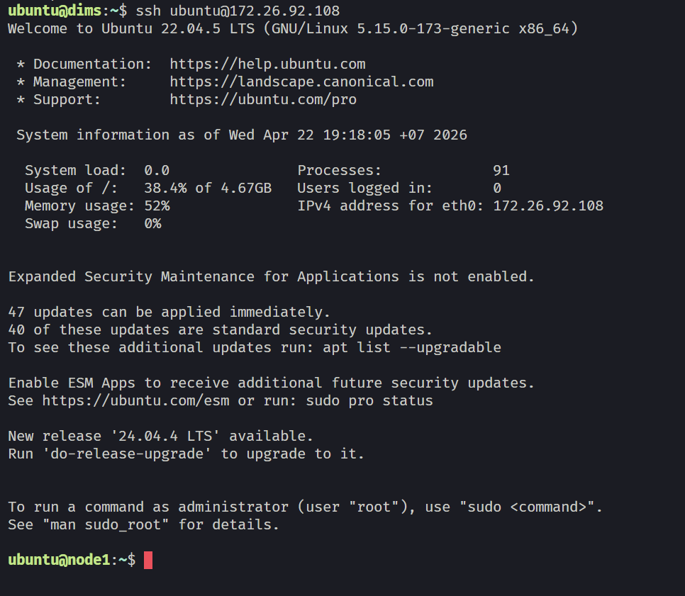
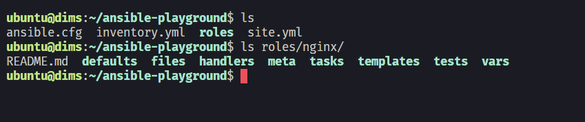
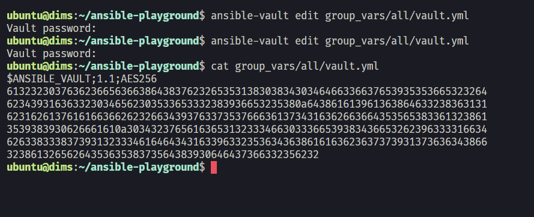
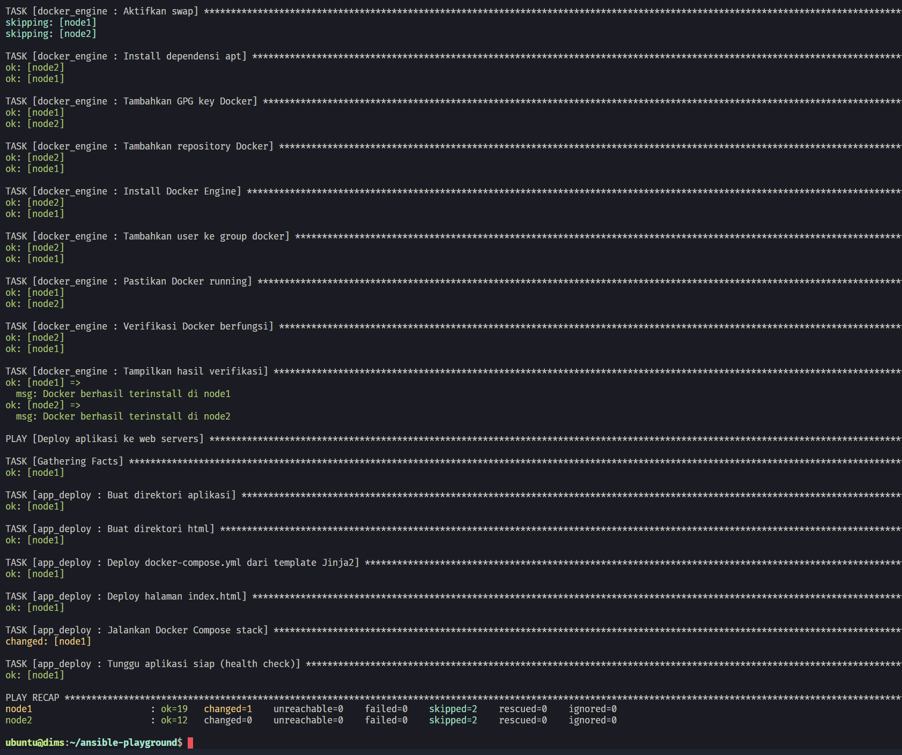
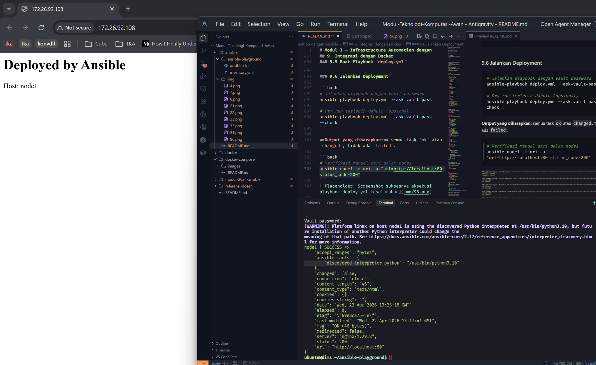

# Modul 3 — Infrastructure Automation dengan Ansible

## Daftar Isi
1. [Konsep Dasar & Posisi Ansible](#1-konsep-dasar--posisi-ansible)
2. [Instalasi & Konfigurasi](#2-instalasi--konfigurasi)
3. [Inventory](#3-inventory)
4. [Ad-hoc Commands](#4-ad-hoc-commands)
5. [Playbook](#5-playbook)
6. [Variables, Handlers & Template Jinja2](#6-variables-handlers--template-jinja2)
7. [Roles](#7-roles)
8. [Ansible Vault](#8-ansible-vault)
9. [Integrasi dengan Docker](#9-integrasi-dengan-docker)

---

## 1. Konsep Dasar & Posisi Ansible

### 1.1 Apa itu Infrastructure as Code (IaC)?
Infrastructure as Code adalah praktik mendefinisikan dan mengelola infrastruktur (server, jaringan, konfigurasi) menggunakan file kode yang bisa di-*version control*, sama seperti kode aplikasi. 

Bayangkan Anda harus setup 10 server identik. Tanpa IaC, Anda harus melakukan SSH ke satu per satu server dan mengetik perintah yang sama berulang kali. Dengan IaC, Anda tulis kode sekali, jalankan ke semua sekaligus.

### 1.2 Perbandingan Tool IaC
| Tool | Pendekatan | Agentless? | Fokus |
|------|-----------|-----------|-------|
| **Ansible** | Prosedural/Deklaratif | Ya (SSH) | Configuration management, deployment |
| Terraform | Deklaratif | Ya (API) | Provisioning infrastruktur cloud |
| Chef/Puppet | Deklaratif | Tidak (butuh agent) | Configuration management |

Ansible dipilih di modul ini karena:
- **Agentless**: tidak perlu install software apapun di server target, cukup SSH.
- **YAML**: menggunakan sintaks yang mudah dibaca manusia.
- **Idempoten**: menjalankan playbook berkali-kali menghasilkan kondisi akhir yang sama tanpa mengeksekusi ulang konfigurasi yang sudah sesuai.
- **Ekosistem luas**: tersedia ribuan modul siap pakai.

### 1.3 Arsitektur Ansible
```text
┌─────────────────────────────────────────────────────────┐
│                    Control Node                         │
│   (laptop/server Anda, tempat Ansible diinstall)        │
│                                                         │
│   ansible.cfg  ──►  konfigurasi global                  │
│   inventory    ──►  daftar host target                  │
│   playbook.yml ──►  instruksi yang akan dijalankan      │
└──────────────┬──────────────────────────────────────────┘
               │  SSH (tanpa agent)
    ┌──────────▼──────────┐    ┌──────────────────────────┐
    │    Managed Node 1   │    │    Managed Node 2        │
    │  (server target)    │    │  (server target)         │
    │  Ubuntu/CentOS/dll  │    │  Ubuntu/CentOS/dll       │
    └─────────────────────┘    └──────────────────────────┘
```

---

## 2. Instalasi & Konfigurasi

### 2.1 Persiapan Lab Environment
Kita akan menggunakan **Multipass** untuk membuat VM ringan sebagai *managed nodes*. (Gunakan Docker container jika tidak menggunakan Multipass).

```bash
# Install Multipass (Ubuntu/Debian, atau download .exe untuk Windows)
sudo snap install multipass

# Buat 2 VM sebagai managed nodes
multipass launch --name node1 --cpus 1 --memory 512M --disk 5G 22.04
multipass launch --name node2 --cpus 1 --memory 512M --disk 5G 22.04

# Cek status VM (catat IP address-nya)
multipass list
```


### 2.2 Install Ansible di Control Node

Ansible dapat diinstall pada perangkat dengan OS UNIX-based yang mencakup RedHat, Debian, Ubuntu, macOS, BSD, Windows Subsystem for Linux (WSL) dengan requirement sudah terinstall Python versi 3.9 atau yang lebih baru. Ansible tidak dapat diinstall pada Windows secara langsung tanpa WSL. Dengan demikian, disarankan untuk tidak menggunakan Windows sebagai OS perangkat utama yang akan mengontrol seluruh task Ansible.

***

#### 1. Cara Installasi dengan `pip`

Untuk melakukan installasi Ansible secara umum untuk semua OS yang disupport, ikuti langkah-langkah berikut.

1. Pastikan versi Python sudah sesuai (Versi yang didukung adalah Python 3.9 atau yang lebih baru)

```bash
python --version
```

2. Pastikan `pip` sudah terinstall

```bash
python3 -m pip -V
```

**NOTE:** Jika `pip` belum terinstall, silakan ikuti langkah installasi pada dokumentasi [berikut.](https://pip.pypa.io/en/stable/installation/)

3. Instal Ansible

```bash
python3 -m pip install --user ansible
```

4. Pastikan Ansible telah terinstall

```bash
ansible --version
```

***

#### 2. Cara Installasi Lain untuk Ubuntu or Debian

Untuk melakukan installasi Ansible pada Linux Ubuntu atau Debian-based, ikuti langkah-langkah berikut.

1. Lakukan update

```bash
sudo apt-get update
```

2. Install dependency untuk Ansible

```bash
sudo apt-get install software-properties-common
```

3. Masukan repository Ansible

```bash
sudo add-apt-repository --yes --update ppa:ansible/ansible
```

4. Install Ansible

```bash
sudo apt-get install ansible
```

5. Pastikan Ansible telah terinstall

```bash
ansible --version
```

**NOTE**
* Ansible versi terbaru saat ini mendukung Ubuntu 18.04, 20.04, dan yang lebih baru.
* Apabila menggunakan versi Ubuntu yang lebih lama, ubah `software-properties-common` menjadi `python-software-properties`. 

***

#### 3. Cara Installasi untuk WSL

Installasi untuk WSL dapat mengikuti langkah-langkah pada dokumentasi [berikut.](https://docs.ansible.com/ansible/latest/os_guide/windows_faq.html#windows-faq-ansible)

#### 4. Cara Installasi untuk MacOS

Instalasi untuk MacOS dapat mengikuti langkah-langkah pada dokumentasi [berikut.](https://docs.ansible.com/ansible/2.9/installation_guide/intro_installation.html#installing-ansible-on-macos)


```bash
# Verifikasi instalasi
ansible --version

# Install collection Docker (dibutuhkan di bagian 9)
ansible-galaxy collection install community.docker
```


### 2.3 Setup SSH Key Authentication
Agar Ansible bisa melakukan SSH tanpa input password terus menerus.

> **Catatan:** Perintah `multipass` **tidak tersedia** di dalam VM `dims`. Semua perintah `multipass exec` di bawah ini dijalankan dari **Windows PowerShell** (host), bukan dari dalam VM.

**Langkah 1 — Generate SSH key di dalam `dims` (dari Windows PowerShell):**

```powershell
# Jalankan dari Windows PowerShell, bukan dari dalam VM
multipass exec dims -- bash -c "ssh-keygen -t rsa -b 4096 -f /home/ubuntu/.ssh/id_rsa -q -N ''"
```

**Langkah 2 — Ambil public key dari `dims`:**

```powershell
multipass exec dims -- cat /home/ubuntu/.ssh/id_rsa.pub
```

Salin output public key tersebut (format: `ssh-rsa AAAA... ubuntu@dims`).

**Langkah 3 — Inject public key ke `node1` dan `node2` (dari Windows PowerShell):**

```powershell
# Ganti <PUBLIC_KEY> dengan output dari langkah 2
multipass exec node1 -- bash -c "mkdir -p /home/ubuntu/.ssh && echo '<PUBLIC_KEY>' >> /home/ubuntu/.ssh/authorized_keys && chmod 700 /home/ubuntu/.ssh && chmod 600 /home/ubuntu/.ssh/authorized_keys"

multipass exec node2 -- bash -c "mkdir -p /home/ubuntu/.ssh && echo '<PUBLIC_KEY>' >> /home/ubuntu/.ssh/authorized_keys && chmod 700 /home/ubuntu/.ssh && chmod 600 /home/ubuntu/.ssh/authorized_keys"
```

**Langkah 4 — Verifikasi koneksi SSH dari dalam `dims`:**

```bash
# Jalankan dari dalam VM dims (multipass shell dims)
ssh ubuntu@<IP_NODE1>
```

Output yang diharapkan:



### 2.4 Konfigurasi `ansible.cfg`
Buat file `ansible.cfg` di dalam folder project Ansible Anda.

```ini
# ansible.cfg
[defaults]
inventory       = inventory.yml
remote_user     = ubuntu
private_key_file = ~/.ssh/id_rsa
host_key_checking = False
stdout_callback = yaml

[privilege_escalation]
become      = True
become_method = sudo
become_user = root
```

---

## 3. Inventory

Inventory adalah tempat mendaftarkan IP/Hostname target agar dikenali oleh Ansible.

### 3.1 Static Inventory (YAML)
Buat file `inventory.yml`.
```yaml
# inventory.yml
all:
  children:
    webservers:
      hosts:
        node1:
          ansible_host: [IP_ADDRESS]   # ganti dengan IP aktual node1
          ansible_user: ubuntu
    dbservers:
      hosts:
        node2:
          ansible_host: [IP_ADDRESS]   # ganti dengan IP aktual node2
          ansible_user: ubuntu
```

### 3.2 Host Variables & Group Variables
Anda juga dapat membuat file variabel yang otomatis ter-load ke inventory.
```text
project/
├── ansible.cfg
├── inventory.yml
├── group_vars/
│   ├── all.yml           # variabel untuk SEMUA host
│   └── webservers.yml    # variabel khusus group webservers
└── host_vars/
    └── node1.yml         # variabel khusus node1 saja
```

### 3.3 Verifikasi Inventory
```bash
# Lihat hierarki tree dari inventory Anda
ansible-inventory --graph
```


---

## 4. Ad-hoc Commands

Ad-hoc digunakan untuk eksekusi instruksi instan. Sintaksnya: `ansible <target> -m <module> -a "<argumen>"`

```bash
# Ping semua host untuk cek konektivitas Ansible
ansible all -m ping

# Jalankan perintah shell
ansible webservers -m shell -a "uptime"

# Kelola / Install paket langsung
ansible all -m apt -a "name=htop state=present update_cache=yes"

# Gather facts (Menarik informasi OS, IP, RAM, dll dari host)
ansible node1 -m gather_facts
```


---

## 5. Playbook

Playbook adalah instruksi lengkap berbasis YAML yang dijalankan ke host.

### 5.1 Struktur Dasar Playbook
```yaml
# site.yml
---
- name: Konfigurasi web server
  hosts: webservers
  become: true
  gather_facts: true

  tasks:
    - name: Update apt cache
      apt:
        update_cache: yes
        cache_valid_time: 3600

    - name: Install Nginx
      apt:
        name: nginx
        state: present

    - name: Pastikan Nginx berjalan dan auto-start
      service:
        name: nginx
        state: started
        enabled: yes
```

Jalankan playbook:
```bash
ansible-playbook site.yml
```


### 5.2 Modul-Modul Lain yang Sering Digunakan
```yaml
tasks:
  - name: Buat direktori /var/www/myapp
    file:
      path: /var/www/myapp
      state: directory

  - name: Copy file statis konfigurasi
    copy:
      src: files/nginx.conf
      dest: /etc/nginx/nginx.conf
      backup: yes

  - name: Verifikasi aplikasi berjalan dengan module URI
    uri:
      url: http://localhost:80
      status_code: 200
```

---

## 6. Variables, Handlers & Template Jinja2

### 6.1 Variables dan Loops
Menjalankan *tasks* berulang kali dengan input berbeda.
```yaml
  vars:
    app_port: 8080
    
  tasks:
    - name: Install paket-paket dasar menggunakan Loop
      apt:
        name: "{{ item }}"
        state: present
      loop:
        - git
        - curl
        - unzip
```

### 6.2 Handlers
Handler adalah task khusus yang hanya dijalankan jika ia di-*notify* (dipanggil) oleh task lain (biasanya jika ada perubahan konfigurasi).
```yaml
  handlers:
    - name: reload nginx
      service:
        name: nginx
        state: reloaded

  tasks:
    - name: Deploy file konfigurasi web
      template:
        src: templates/site.conf.j2
        dest: /etc/nginx/sites-available/default
      notify: reload nginx
```

### 6.3 Template Jinja2
Membentuk file konfigurasi yang isinya diinjeksi dengan *variables* dari Ansible.
```jinja2
{# templates/nginx.conf.j2 #}
server {
    listen {{ nginx_port | default(80) }};
    server_name {{ vhost_server_name }};
    root /var/www/html;
}
```

---

## 7. Roles

Role membuat playbook kita dapat digunakan ulang dengan struktur modular.
```bash
ansible-galaxy init roles/nginx
```


Contoh memanggil role pada file utama:
```yaml
# site.yml — playbook utama
---
- name: Konfigurasi web servers
  hosts: webservers
  become: true
  roles:
    - role: nginx
      vars:
        nginx_port: 80
        nginx_root: /var/www/myapp

- name: Konfigurasi database servers
  hosts: dbservers
  become: true
  roles:
    - role: mariadb
```

---

## 8. Ansible Vault

Vault mengamankan data rahasia seperti password.

```bash
# Membuat file variabel terenkripsi
ansible-vault create group_vars/all/vault.yml

# Edit file encrypted
ansible-vault edit group_vars/all/vault.yml
```

**Cara Penggunaan di Variables:**
```yaml
# group_vars/all/vault.yml (ENCRYPTED)
vault_db_root_password: "SuperSecretP@ss123"

# group_vars/all/vars.yml (PLAIN TEXT)
# Mereferensikan nilai dari vault
db_root_password: "{{ vault_db_root_password }}"

```


Jika playbook memanggil file vault, jalankan dengan command berikut:
```bash
ansible-playbook site.yml --ask-vault-pass
```


---

## 9. Integrasi dengan Docker

Di bagian ini kita menggabungkan semua yang sudah dipelajari untuk mengotomasi instalasi Docker dan deployment Docker Compose ke managed nodes via Ansible.

> **Pra-syarat:** Pastikan `community.docker` collection sudah terinstall (sudah dilakukan di bagian 2.2).

---

### 9.1 Scaffold Role Structure

Buat struktur dua role baru dari dalam `dims`:

```bash
ansible-galaxy init roles/docker_engine
ansible-galaxy init roles/app_deploy
```

---

### 9.2 Role `docker_engine` — Install Docker via Ansible

Role ini menginstall Docker Engine secara penuh di managed node.

**`roles/docker_engine/tasks/main.yml`:**
```yaml
---
- name: Install dependensi apt
  apt:
    name:
      - apt-transport-https
      - ca-certificates
      - curl
      - gnupg
      - lsb-release
    state: present
    update_cache: yes

- name: Tambahkan GPG key Docker
  apt_key:
    url: https://download.docker.com/linux/ubuntu/gpg
    state: present

- name: Tambahkan repository Docker
  apt_repository:
    repo: "deb [arch=amd64] https://download.docker.com/linux/ubuntu {{ ansible_distribution_release }} stable"
    state: present
    filename: docker

- name: Install Docker Engine
  apt:
    name:
      - docker-ce
      - docker-ce-cli
      - containerd.io
      - docker-compose-plugin
    state: present
    update_cache: yes

- name: Tambahkan user ke group docker
  user:
    name: "{{ ansible_user }}"
    groups: docker
    append: yes

- name: Pastikan Docker running
  service:
    name: docker
    state: started
    enabled: yes

- name: Verifikasi Docker berfungsi
  command: docker run --rm hello-world
  changed_when: false
  register: docker_test

- name: Tampilkan hasil verifikasi
  debug:
    msg: "Docker berhasil terinstall di {{ inventory_hostname }}"
  when: docker_test.rc == 0
```

---

### 9.3 Role `app_deploy` — Deploy Docker Compose

Role ini men-deploy stack Docker Compose ke node menggunakan template Jinja2.

**`roles/app_deploy/defaults/main.yml`:**
```yaml
app_dir: /opt/myapp
app_user: ubuntu
app_image_tag: latest
app_port: 80

# Variabel sensitif — nilai aslinya dari Ansible Vault
db_name: appdb
db_user: appuser
db_password: "{{ vault_db_password }}"
db_root_password: "{{ vault_db_root_password }}"
```

**`roles/app_deploy/tasks/main.yml`:**
```yaml
---
- name: Buat direktori aplikasi
  file:
    path: "{{ app_dir }}"
    state: directory
    owner: "{{ app_user }}"
    group: "{{ app_user }}"
    mode: '0755'

- name: Buat direktori html
  file:
    path: "{{ app_dir }}/html"
    state: directory
    owner: "{{ app_user }}"
    mode: '0755'

- name: Deploy docker-compose.yml dari template Jinja2
  template:
    src: docker-compose.yml.j2
    dest: "{{ app_dir }}/docker-compose.yml"
    owner: "{{ app_user }}"
    mode: '0644'
  notify: restart app stack

- name: Deploy halaman index.html
  copy:
    content: "<h1>Deployed by Ansible</h1><p>Host: {{ inventory_hostname }}</p>"
    dest: "{{ app_dir }}/html/index.html"
    owner: "{{ app_user }}"
    mode: '0644'

- name: Jalankan Docker Compose stack
  community.docker.docker_compose_v2:
    project_src: "{{ app_dir }}"
    state: present

- name: Tunggu aplikasi siap (health check)
  uri:
    url: "http://localhost:{{ app_port }}"
    status_code: 200
  register: health_check
  retries: 10
  delay: 5
  until: health_check.status == 200
```

**`roles/app_deploy/handlers/main.yml`:**
```yaml
---
- name: restart app stack
  community.docker.docker_compose_v2:
    project_src: "{{ app_dir }}"
    state: present
    recreate: always
```

**`roles/app_deploy/templates/docker-compose.yml.j2`:**
```jinja2
services:
  web:
    image: nginx:{{ app_image_tag }}
    ports:
      - "{{ app_port }}:80"
    volumes:
      - ./html:/usr/share/nginx/html:ro
    restart: unless-stopped

  db:
    image: mariadb:10.11
    environment:
      MYSQL_ROOT_PASSWORD: {{ db_root_password }}
      MYSQL_DATABASE: {{ db_name }}
      MYSQL_USER: {{ db_user }}
      MYSQL_PASSWORD: {{ db_password }}
    volumes:
      - db_data:/var/lib/mysql
    restart: unless-stopped

volumes:
  db_data:
```

---

### 9.4 Tambahkan Secrets ke Vault

Tambahkan variabel password ke vault yang sudah ada:

```bash
ansible-vault edit group_vars/all/vault.yml
```

Tambahkan baris berikut ke isi vault:
```yaml
vault_db_root_password: "RootP@ss123"
vault_db_password: "AppP@ss456"
```

---

### 9.5 Buat Playbook `deploy.yml`

```yaml
# deploy.yml
---
- name: Install Docker di semua node
  hosts: all
  become: true
  roles:
    - role: docker_engine

- name: Deploy aplikasi ke web servers
  hosts: webservers
  become: true
  roles:
    - role: app_deploy
      vars:
        app_image_tag: "latest"
        app_port: 80
```

---

### 9.6 Jalankan Deployment

```bash
# Jalankan playbook dengan vault password
ansible-playbook deploy.yml --ask-vault-pass

# Dry run terlebih dahulu (opsional)
ansible-playbook deploy.yml --ask-vault-pass --check
```

**Output yang diharapkan:** semua task `ok` atau `changed`, tidak ada `failed`.

```bash
# Verifikasi manual dari dalam node1
ansible node1 -m uri -a "url=http://localhost:80 status_code=200"
```




---

## Soal Latihan
Dalam sebuah skenario maintenance sistem, Anda diminta untuk melakukan deployment halaman maintenance secara otomatis ke beberapa server menggunakan Ansible. Ketentuan: 
1. Gunakan Multipass untuk membuat satu node sebagai target host.
2. Buat dua role Ansible, yaitu docker dan maintenance.
   - Role docker digunakan untuk menginstall Docker Engine dan memastikan Docker dapat berjalan di semua node.
   - Role maintenance menggunakan template Jinja2 untuk menghasilkan file HTML dengan variabel message dan bg_color, dengan bg_color: red dan message: "Website under maintenance" 
3. Pada role maintenance, jalankan service nginx melalui container Docker agar halaman dapat diakses melalui browser.
4. Buat playbook deploy.yml yang memanggil docker lalu maintenance dan override variabel bg_color menjadi "blue"
5. Lakukan verifikasi untuk memastikan:
   - File /var/www/html/index.html berhasil dibuat di semua node
   - Container nginx berjalan di semua node
   - Halaman dapat diakses melalui browser
     
*Modul 3 — Infrastructure Automation dengan Ansible*  
*Cloud Computing · Teknologi Informasi ITS*
