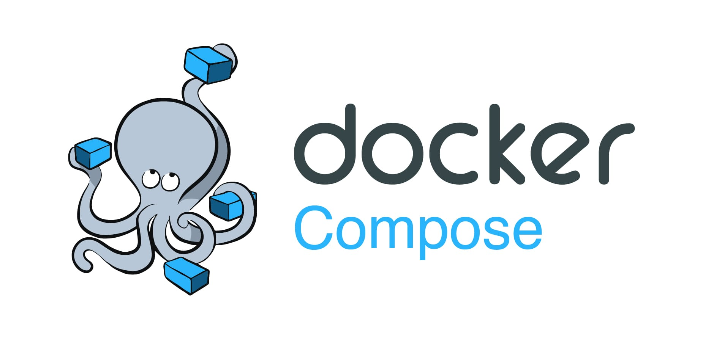
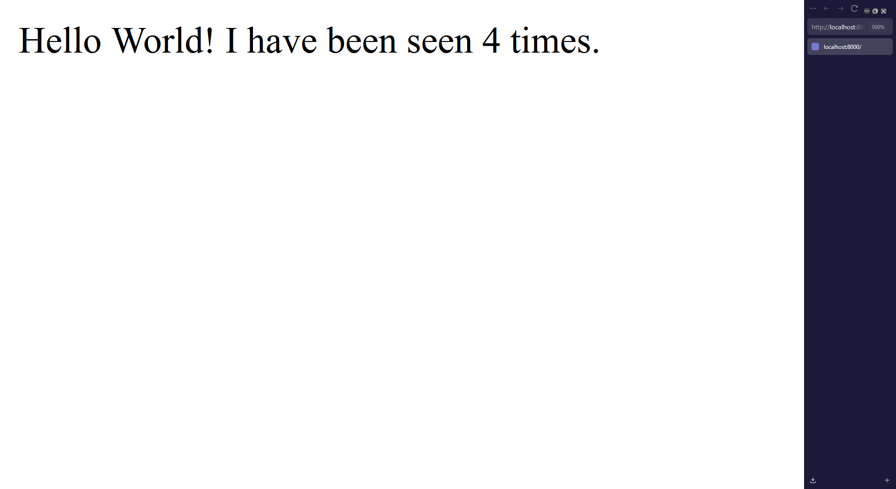

# DOCKER COMPOSE


## Daftar Isi
- [Definisi Docker Compose](#definisi)
- [Manfaat Docker Compose](#mengapa-menggunakan-docker-compose)
    - [Contoh Penggunaan Docker Compose](#contoh-penggunaan-docker-compose)
- [Contoh Implementasi](#contoh-implementasi)
- [Soal Latihan](#soal-latihan)
- [Referensi](#referensi)


## Definisi
Docker Compose adalah tool untuk mendefinisikan dan menjalankan aplikasi multi-kontainer. Compose menyederhanakan kontrol aplikasi sehingga memudahkan pengelolaan services, networkd, dan volume dalam satu file YAML. 

Compose berfungsi di semua lingkungan - production, staging, development, testing, serta alur kerja CI. Compose juga memiliki perintah untuk mengelola seluruh siklus hidup aplikasi yaitu:
- Start, stop, dan rebuild service.
- Melihat status layanan yang sedang berjalan.
- Stream log output dari layanan yang sedang berjalan.
- Menjalankan perintah satu kali pada sebuah layanan.

## Mengapa menggunakan Docker Compose?
Penggunaan Docker Compose menawarkan beberapa manfaat yang menyederhanakan development, deployment, dan manajemen aplikasi berbasis kontainer:

- **Simplified control**: Definisikan dan kelola aplikasi multi-kontainer dalam satu file YAML, menyederhanakan pengaturan.

- **Efficient collaboration**: File YAML yang dapat dibagikan mendukung kolaborasi yang lancar antara developer dan tim operasional, meningkatkan workflow dan issue resolution, sehingga meningkatkan efisiensi secara keseluruhan.

- **Rapid application development**: Compose menyimpan konfigurasi yang digunakan untuk membuat kontainer. Ketika restart service yang tidak berubah, compose me-reuse container yang sudah ada. Hal ini berarti kita dapat melakukan perubahan pada environment kita.

- **Portability across environments**:  Compose mendukung variabel dalam file Compose. Variabel ini dapat digunakan untuk menyesuaikan komposisi environment atau user yang berbeda.

### Contoh Penggunaan Docker Compose
#### A. Development environments
Saat mengembangkan software, kita harus bisa run aplikasi di isolated environment dan mengaksesnya. Compose command line bisa digunakan untuk membuat environment dan berinteraksi dengan software.

#### B. Automated testing environments
Bagian penting dari setiap proses Continuous Deployment (CD) atau Continuous Integration (CI) adalah autonated test suite. Automated end-to-end testing membutuhkan environment untuk menjalankan pengujian. Compose menyediakan cara mudah untuk membuat dan menghapus environment isolated testing untuk testing. 

Ilustrasi penggunaan Docker Compose:
```sh
docker compose up -d
./run_tests
docker compose down
```

## Contoh Implementasi
Untuk memahami konsep Docker Compose, kita bisa mencoba membuat sebuah proyek infrastruktur sederhana menggunakan Flask, Redis, dan Docker Volume.

### Step 1: Membuat aplikasi

1. Siapkan direktori `/app` untuk mempermudah.
  ```sh
  mkdir app
  cd app
  ```
2. Buat file `app.py` dan gunakan *sample code* berikut:
  ```py
  import time
  
  import redis
  from flask import Flask
  
  app = Flask(__name__)
  cache = redis.Redis(host='redis', port=6379)
  
  def get_hit_count():
      retries = 5
      while True:
          try:
              return cache.incr('hits')
          except redis.exceptions.ConnectionError as exc:
              if retries == 0:
                  raise exc
              retries -= 1
              time.sleep(0.5)
  
  @app.route('/')
  def hello():
      count = get_hit_count()
      return 'Hello World! I have been seen {} times.\n'.format(count)
  ```
  Aplikasi sederhana ini akan:
  - melakukan increment sebuah angka setiap kali dikunjungi
  - menyimpan angka tersebut dalam cache Redis

3. Buat file `requirements.txt` untuk menentukan dependencies Python:
  ```
  flask
  redis
  ```

### Step 2: Membuat Dockerfile
Buatlah sebuah `Dockerfile` dalam direktori `/app`:
```Dockerfile
FROM python:3.7-alpine

ENV FLASK_APP=app.py
ENV FLASK_RUN_HOST=0.0.0.0

WORKDIR /code
COPY . .
RUN apk add --no-cache gcc musl-dev linux-headers
RUN pip install -r requirements.txt

EXPOSE 5000
CMD ["flask", "run"]
```
Keterangan:
- Menggunakan image Python 3.7
- Set environment variable untuk Flask
- Set work directory ke `/code`
- Copy semua file yang diperlukan ke dalam work directory
- Install dependensi
- Hubungkan ke port 5000 dan jalankan app Flask

### Step 3: Membuat Docker Compose YAML
Buatlah sebuah `docker-compose.yml` di luar folder `/app`. Mengapa di luar folder aplikasi? Karena dalam use case nyata, Docker Compose umumnya digunakan untuk melakukan "*orchestra*" untuk berbagai aplikasi sekaligus sehingga baiknya diletakkan di luar folder aplikasi target kita.
```yml
services:
  web:
    build: ./app
    ports:
      - "8000:5000"
    volumes:
      - ./app:/code
  
  redis:
    image: "redis:alpine"
    command: redis-server --appendonly yes
    volumes:
      - redis_data:/data

volumes:
  redis_data:
```
Keterangan:
- Menyalakan service web ke port 8000 host
- Menyalakan service redis untuk `append only`
- Simpan semua data redis untuk terhubung volume

### Step 4: Build aplikasi
1. Nyalakan aplikasi dengan:
  ```sh
  # lakukan di folder yang sama dengan file docker-compose.yml
  docker compose up     # Untuk dijalankan di foreground
  docker compose up -d  # Untuk dijalankan di background
  ```
2. Cek di `localhost:8000`:
  
3. Matikan service bila selesai digunakan (variabel angka akan tersimpan di volume!)
  ```sh
  # lakukan di folder yang sama dengan file docker-compose.yml
  docker compose down
  ```

## Soal Latihan

## Referensi
- [Definisi Docker Compose](https://docs.docker.com/compose/)
- [Manfaat Docker Compose](https://docs.docker.com/compose/intro/features-uses/)

