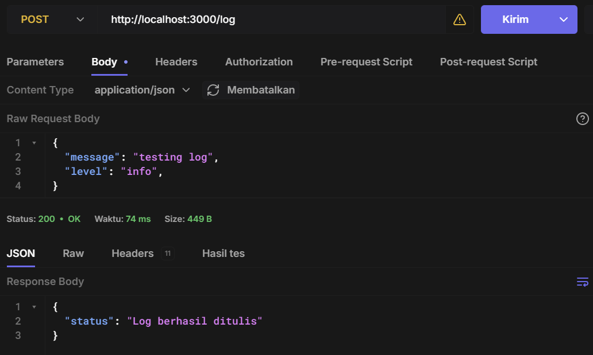
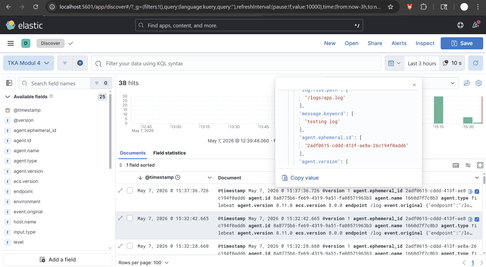
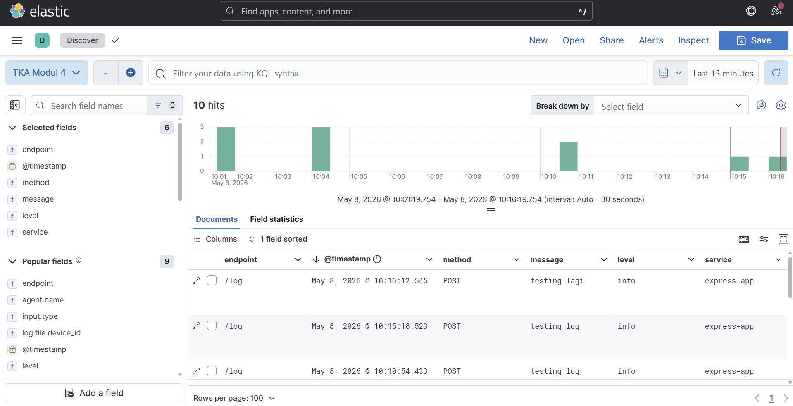
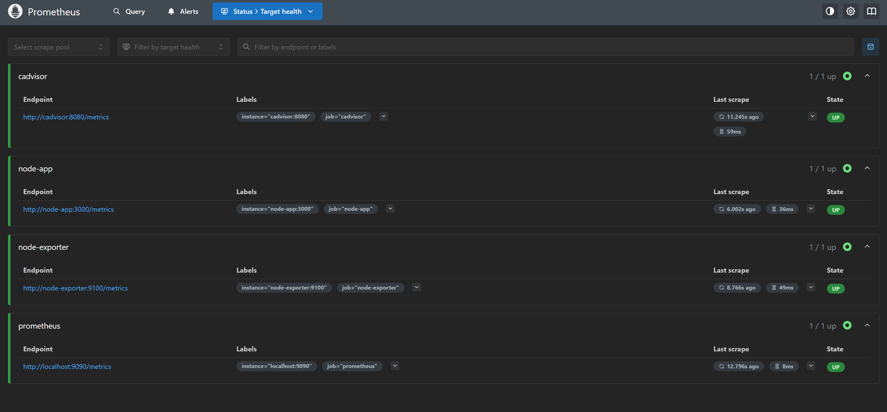
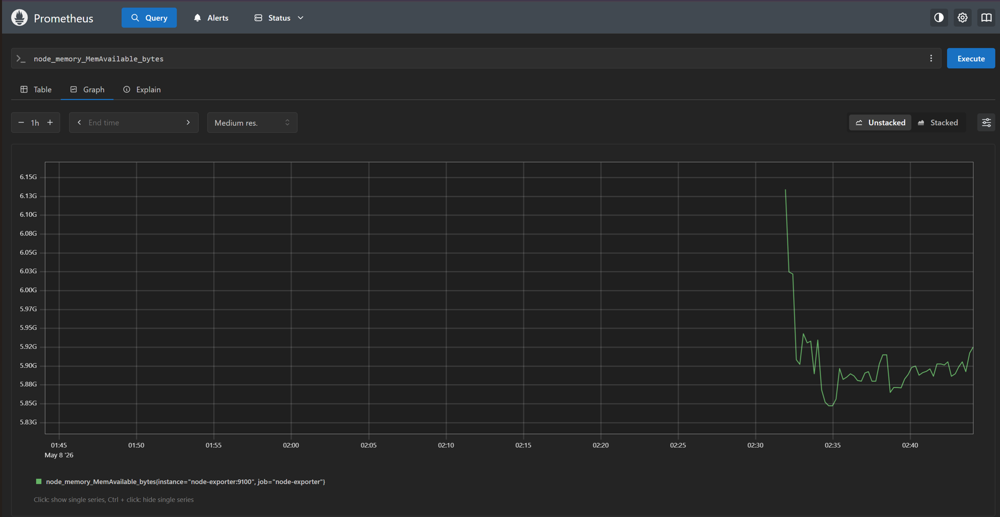
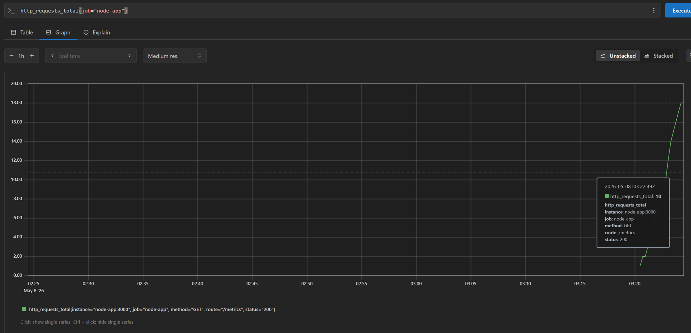

# Modul 4 - Logging dan Monitoring  

## Daftar Isi

1. [Pendahuluan](#1-pendahuluan)  
2. [Konsep Logging & Monitoring](#2-konsep-logging--monitoring)  
3. [Kenapa Logging & Monitoring Penting?](#3-kenapa-logging--monitoring-penting)  
4. [Tools yang Digunakan](#4-tools-yang-digunakan)  
5. [Arsitektur Sistem](#5-arsitektur-sistem)  
6. [Implementasi ELK Stack](#6-implementasi-elk-stack)  

## 1. Pendahuluan   

Dalam sistem berbasis komputasi awan, aplikasi tidak hanya berjalan secara lokal, tetapi biasanya tersebar dalam beberapa layanan seperti microservices, container, atau server cloud.

Semakin kompleks sistem, maka muncul tantangan utama:
1. Bagaimana mengetahui error yang terjadi di sistem?
2. Bagaimana memantau performa aplikasi secara real-time?
3. Bagaimana menganalisis perilaku sistem saat terjadi masalah?

Untuk menjawab tantangan tersebut, digunakan konsep logging dan monitoring dalam sistem observability.

## 2. Konsep Logging & Monitoring

### 2.1 Logging
Logging adalah proses untuk mencatat semua kejadian yang terjadi dalam sistem.

Fungsi utama logging:
1. Menyimpan riwayat aktivitas sistem
2. Membantu proses troubleshooting
3. Mendukung audit dan keamanan sistem

Data log berisi informasi seperti error aplikasi, aktivitas pengguna, dan event sistem. Selain itu, log juga dapat digunakan untuk mendeteksi pola atau aktivitas tidak normal yang berpotensi menjadi masalah keamanan.

### 2.2 Monitoring
Monitoring adalah proses untuk memantau performa dan kesehatan sistem secara real-time.

Fungsi utama monitoring:
1. Memberikan visibilitas terhadap performa sistem secara langsung
2. Mendeteksi masalah sebelum menjadi kritis
3. Memantau server, jaringan, dan aplikasi

Contohnya, monitoring dapat digunakan untuk memantau penggunaan CPU, RAM, dan traffic jaringan untuk mengetahui apakah sistem mengalami beban berlebih.

## 3. Kenapa Logging & Monitoring Penting?
Logging dan Monitoring saling melengkapi dalam sistem modern. Monitoring digunakan untuk mendeteksi adanya masalah pada sistem secara real-time, sedangkan logging digunakan untuk menganalisis penyebab dari masalah tersebut berdasarkan data historis yang tersimpan.

Kombinasi keduanya memberikan gambaran menyeluruh terhadap sistem, sehingga:
- Proses troubleshooting lebih cepat
- Performa sistem lebih optimal
- Keamanan sistem lebih terjaga

## 4. Tools yang Digunakan
### 4.1 ELK Stack
ELK Stack adalah kumpulan tiga alat open-source yang digunakan untuk logging dan analisis data:
1. **Elasticsearch**: Mesin pencari dan analisis data yang digunakan untuk menyimpan dan mencari log.
2. **Logstash**: Alat untuk mengumpulkan, memproses, dan mengirim data log ke Elasticsearch.
3. **Kibana**: Alat visualisasi yang digunakan untuk membuat dashboard dan memvisualisasikan data log dari Elasticsearch.
Fungsi utama ELK Stack adalah untuk mengelola dan menganalisis data log secara efisien, sehingga memudahkan proses troubleshooting dan pemantauan sistem.

### 4.2 Prometheus
Prometheus adalah toolkit pemantauan (monitoring) dan sistem peringatan (alerting) open source yang awalnya dibangun di SoundCloud. Berbeda dengan ELK Stack yang berfokus pada Logs (teks kejadian), Prometheus berfokus pada Metrics (data numerik dalam rentang waktu tertentu). Prometheus mengumpulkan data dalam bentuk Time Series Data, yaitu data yang dicatat berdasarkan urutan waktu (misalnya: penggunaan CPU saat ini, jumlah request per detik, atau sisa memori).

### Tipe Metrics

### 1. Counter
Nilai yang hanya bisa **naik** (tidak pernah turun). Digunakan untuk menghitung jumlah kejadian kumulatif. Contoh: total request yang masuk, total error, total bytes yang dikirim.
```
http_requests_total{method="GET"} 1500
```

### 2. Gauge
Nilai yang bisa **naik maupun turun**. Digunakan untuk nilai yang berubah-ubah. Contoh: penggunaan CPU, jumlah koneksi aktif, penggunaan memori saat ini.
```
node_memory_MemAvailable_bytes 2.34e+09
process_open_fds 25
```

### 3. Histogram
Mengukur distribusi nilai dalam beberapa **bucket** (rentang). Berguna untuk mengukur latensi request atau ukuran response.
```
http_request_duration_seconds_bucket{le="0.1"} 240
http_request_duration_seconds_bucket{le="0.5"} 480
http_request_duration_seconds_bucket{le="1.0"} 500
http_request_duration_seconds_count 500
http_request_duration_seconds_sum 120.4
```

### 4. Summary
Mirip Histogram, tetapi menghitung **quantile** (persentil) di sisi client langsung. Kurang fleksibel dibandingkan Histogram karena quantile dihitung di aplikasi, bukan di Prometheus.
```
rpc_duration_seconds{quantile="0.5"} 0.052
rpc_duration_seconds{quantile="0.9"} 0.098
rpc_duration_seconds{quantile="0.99"} 0.152
```

---

### 4.3 Grafana


## 5. Arsitektur Sistem
```
                Web Application
                        │
         ┌──────────────┴──────────────┐
         │                             │
       Logs                        Metrics
         │                             │
         ▼                             ▼
     Logstash                    Prometheus
         │                             │
         ▼                             ▼
  Elasticsearch                   Grafana
         │
         ▼
       Kibana
```
Web Application menghasilkan dua jenis data observability, yaitu logs dan metrics, yang digunakan untuk memantau kondisi sistem secara menyeluruh.
- Logs dikirim dari Web Application ke Logstash. Logstash kemudian memproses, memfilter, dan menyimpan data ke Elasticsearch. Data log ini kemudian divisualisasikan menggunakan Kibana untuk kebutuhan analisis dan troubleshooting.
- Metrics tidak dikirim langsung dari aplikasi ke Prometheus, melainkan diekspos oleh Web Application melalui endpoint khusus (misalnya /metrics). Prometheus kemudian melakukan proses scraping (pengambilan data secara berkala) dari endpoint tersebut untuk dikumpulkan sebagai time-series data. Data metrics ini kemudian divisualisasikan menggunakan Grafana dalam bentuk dashboard monitoring.

## 6. Implementasi ELK Stack
Untuk mengimplementasikan ELK Stack, kita dapat mengikuti langkah-langkah berikut:

1. Buat file `docker-compose.yml` untuk mendefinisikan layanan Elasticsearch, Logstash, dan Kibana.
    ```yaml
    services:
    elasticsearch:
        image: docker.elastic.co/elasticsearch/elasticsearch:8.11.0
        environment:
        - discovery.type=single-node
        - xpack.security.enabled=false
        - cluster.name=elasticsearch
        - ES_JAVA_OPTS=-Xms1g -Xmx1g
        ulimits:
        memlock:
            soft: -1
            hard: -1
        ports:
        - "9200:9200"

    logstash:
        image: docker.elastic.co/logstash/logstash:8.11.0
        volumes:
        - ./logstash.conf:/usr/share/logstash/pipeline/logstash.conf
        ports:
        - "5000:5000" 
        depends_on:
        - elasticsearch

    kibana:
        image: docker.elastic.co/kibana/kibana:8.11.0
        environment:
        - ELASTICSEARCH_HOSTS=http://elasticsearch:9200
        ports:
        - "5601:5601"
        depends_on:
        - elasticsearch
    ```
2. Buat file `logstash.conf` untuk mengkonfigurasi Logstash agar dapat menerima data log dari aplikasi dan mengirimkannya ke Elasticsearch.
    ```conf
    input {
        http {
            host => "0.0.0.0"
            port => 5000
            codec => json
        }
    }

    output {
        elasticsearch {
            hosts => ["http://elasticsearch:9200"]
            index => "app-logs-%{+YYYY.MM.dd}"
        }

        stdout { codec => rubydebug }
    }
    ```
3. Jalankan perintah `docker-compose up -d` untuk memulai layanan ELK Stack.
4. Akses elasticsearch melalui `http://localhost:9200`, Kibana melalui `http://localhost:5601`.


5. Testing dengan mengirimkan data log ke logstash menggunakan curl/postman/hoppscotch.

6. Setelah data log berhasil dikirim, kita dapat cek secara manual di elasticsearch dengan get request ke `http://localhost:9200/app-logs-*/_search?pretty` 

7. Terakhir, kita dapat membuat dashboard di Kibana untuk memvisualisasikan data log yang telah dikirim dengan cara :
    - Buka Kibana di `http://localhost:5601` lalu pilih menu Stack Management 
    
    - Pilih menu Data Views > Create Data View
    
    - Masukkan index pattern `app-logs-*` dan pilih @timestamp lalu save
    
8. Lihat log di Kibana dengan memilih menu Discover lalu pilih data view yang telah dibuat sebelumnya


Untuk integrasi dengan aplikasi, kita dapat menggunakan library seperti `winston` untuk Node.js. Disini kita perlu mengubah beberapa config pada docker compose dan juga logstash.conf karena kita akan menggunakan Filebeat untuk mengirim data log dari aplikasi ke Logstash. 

Filebeat akan membaca file log yang dihasilkan oleh aplikasi dan mengirimkannya ke Logstash untuk diproses lebih lanjut sebelum disimpan di Elasticsearch. Kita menggunakan Filebeat karena lebih efisien dalam mengirim data log dibandingkan dengan menggunakan Logstash secara langsung untuk menerima data log dari aplikasi.

1. Ubah port pada Logstash di `docker-compose.yml` menjadi 5044 untuk menerima data log dari Filebeat.
    ```yaml
    logstash:
        image: docker.elastic.co/logstash/logstash:8.11.0
        volumes:
        - ./logstash.conf:/usr/share/logstash/pipeline/logstash.conf
        ports:
        - "5044:5044"
        depends_on:
        - elasticsearch
    ```
2. Tambahkan service Filebeat pada `docker-compose.yml` untuk mengirim data log dari aplikasi ke Logstash.
    ```yaml
    filebeat:
        image: docker.elastic.co/beats/filebeat:8.11.0
        user: root
        command: filebeat -e --strict.perms=false
        volumes:
        - ./filebeat.yml:/usr/share/filebeat/filebeat.yml
        - ./node-app/logs:/logs
        depends_on:
        - logstash
    ```
3. Ubah longstash.conf untuk menerima data log dari Filebeat melalui input beats.
    ```conf
    input {
        beats {
            port => 5044
        }
    }

    filter {
        json {
            source => "message"
        }
    }

    output {
        elasticsearch {
            hosts => ["http://elasticsearch:9200"]
            index => "app-logs-%{+YYYY.MM.dd}"
        }

        stdout {
            codec => rubydebug
        }
    }
    ```
4. Buat file `filebeat.yml` untuk mengkonfigurasi Filebeat agar dapat membaca file log dari aplikasi dan mengirimkannya ke Logstash.
    ```yaml
    filebeat.inputs:
    - type: filestream
        id: app-logs
        enabled: true
        paths:
        - /logs/app.log

    output.logstash:
    hosts: ["logstash:5044"]
    ```
5. Jalankan perintah `docker-compose up -d` untuk memulai layanan ELK Stack beserta Filebeat.
6. Pastikan aplikasi sudah dikonfigurasi untuk menghasilkan log ke file `app.log` di dalam folder `logs` pada aplikasi. Contoh konfigurasi logging menggunakan winston pada Node.js:
    ```javascript
    const winston = require("winston");

    const logger = winston.createLogger({
    level: "info",

    defaultMeta: {
        service: "express-app",
    },

    format: winston.format.combine(
        winston.format.timestamp(),
        winston.format.json()
    ),

    transports: [
        new winston.transports.Console(),
        new winston.transports.File({
        filename: "logs/app.log",
        }),
    ],
    });

    module.exports = logger;
    ```
    Contoh penggunaan logger di aplikasi:
    ```javascript
    const express = require("express");
    const logger = require("./logger");

    const app = express();

    app.use(express.json());

    app.post("/log", (req, res) => {
        const { level = "info", message = "No message provided" } = req.body;

        logger.log({
            level,
            message,
            service: "express-app",
            endpoint: "/log",
            method: "POST",
        });

        res.json({
            status: "Log berhasil ditulis",
        });
    });

    app.listen(3000, () => {
        logger.info({
            message: "Server started",
            service: "express-app",
            port: 3000,
        });

        console.log("App running on http://localhost:3000");
    });
    ```
7. Setelah aplikasi berjalan, coba kirim data log ke endpoint `/log` dengan menggunakan curl/postman/hoppscotch.

8. Setelah data log berhasil dikirim, kita dapat cek di Kibana dengan memilih menu Discover lalu pilih data view yang telah dibuat sebelumnya untuk melihat log yang telah dikirim dari aplikasi.

9. Kita dapat memilih field-field yang ingin ditampilkan di Kibana, seperti endpoint, timestamp, method, message, level, dan service. Dengan cara ini, kita dapat dengan mudah memfilter dan mencari log berdasarkan field-field tersebut.


## 7. Implementasi Prometheus
Untuk mengimplementasikan Prometheus, kita dapat mengikuti langkah-langkah berikut:

1. Buatlah folder khusus untuk aplikasi Node.js di dalam direktori proyek Anda:

2. Di dalam folder node-app/, siapkan file berikut agar aplikasi dapat memproduksi metrics:
 - package.json:
```
{ "dependencies": { "express": "^4.18.2", "prom-client": "^15.0.0" } }
```
 - Dockerfile:
```
FROM node:18-alpine
WORKDIR /app
COPY package*.json ./
RUN npm install
COPY . .
EXPOSE 3000
CMD ["node", "app.js"]
```
 - app.js
``` js
const client = require('prom-client');

const register = new client.Registry();

// Aktifkan default metrics (CPU, memori, event loop, dll)
client.collectDefaultMetrics({ register });

// Custom counter untuk menghitung HTTP request
const httpRequestCounter = new client.Counter({
  name: 'http_requests_total',
  help: 'Total jumlah HTTP request',
  labelNames: ['method', 'route', 'status'],
  registers: [register],
});

// Tambahkan middleware untuk mencatat setiap request
app.use((req, res, next) => {
  res.on('finish', () => {
    httpRequestCounter.inc({
      method: req.method,
      route: req.path,
      status: res.statusCode,
    });
  });
  next();
});

// Endpoint /metrics untuk di-scrape oleh Prometheus
app.get('/metrics', async (req, res) => {
  res.setHeader('Content-Type', register.contentType);
  res.send(await register.metrics());
});
```

3. Buat file docker-compose.yml untuk mendefinisikan seluruh layanan (Prometheus, Exporters, dan Aplikasi):
``` yaml
services:
  prometheus:
    image: prom/prometheus:latest
    container_name: prometheus
    volumes:
      - ./prometheus.yml:/etc/prometheus/prometheus.yml
      - prometheus_data:/prometheus
    ports:
      - "9090:9090"
    restart: unless-stopped

  node-exporter:
    image: prom/node-exporter:latest
    container_name: node-exporter
    ports:
      - "9100:9100"
    restart: unless-stopped

  cadvisor:
    image: gcr.io/cadvisor/cadvisor:latest
    container_name: cadvisor
    ports:
      - "8080:8080"
    volumes:
      - /:/rootfs:ro
      - /var/run:/var/run:ro
      - /sys:/sys:ro
      - /var/lib/docker/:/var/lib/docker:ro
    restart: unless-stopped

  node-app:
    build: ./node-app
    container_name: node-app
    ports:
      - "3000:3000"
    restart: unless-stopped

volumes:
  prometheus_data:
```

4. Buat file prometheus.yml untuk mendaftarkan semua target scraping:
```yaml
global:
  scrape_interval: 15s

scrape_configs:
  - job_name: "prometheus"
    static_configs:
      - targets: ["localhost:9090"]
  - job_name: "node-exporter"
    static_configs:
      - targets: ["node-exporter:9100"]
  - job_name: "cadvisor"
    static_configs:
      - targets: ["cadvisor:8080"]
  - job_name: "node-app"
    static_configs:
      - targets: ["node-app:3000"]
```

5. Jalankan perintah `docker compose up -d` untuk memulai semua layanan.

6. Akses Prometheus UI melalui `http://localhost:9090`. Buka menu **Status > Target health** dan pastikan semua target berstatus **UP**.


7. Testing dengan mengakses endpoint `/metrics` dari Node Exporter secara langsung menggunakan curl untuk memverifikasi bahwa metrics sudah tersedia.

```bash
curl http://localhost:9100/metrics
```

```bash
curl http://localhost:3000/metrics # Metrics Aplikasi
```
8. Setelah itu, verifikasi data sudah masuk ke Prometheus dengan mencoba query di halaman **Query** pada Prometheus UI.
```promql
node_memory_MemAvailable_bytes
```

```promql
http_requests_total{job="node-app"}
```

