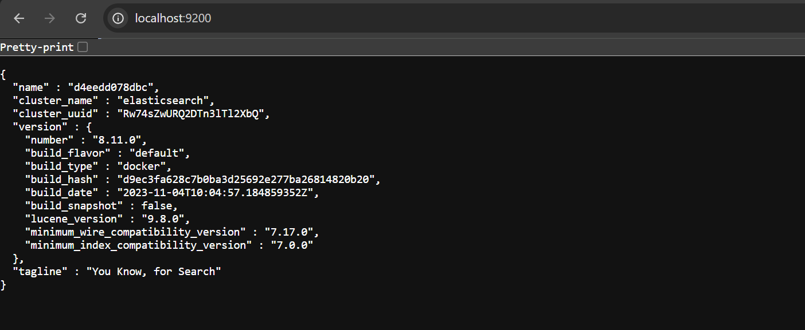
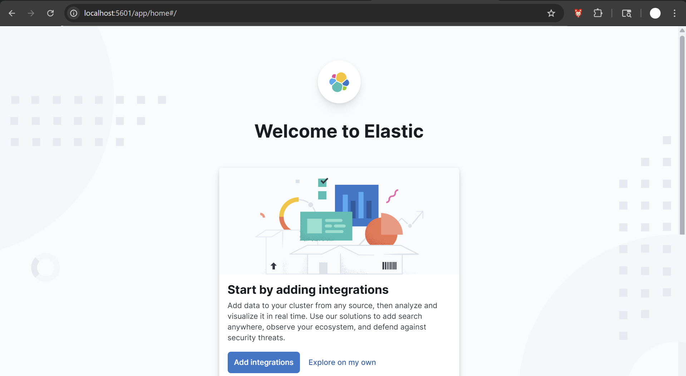
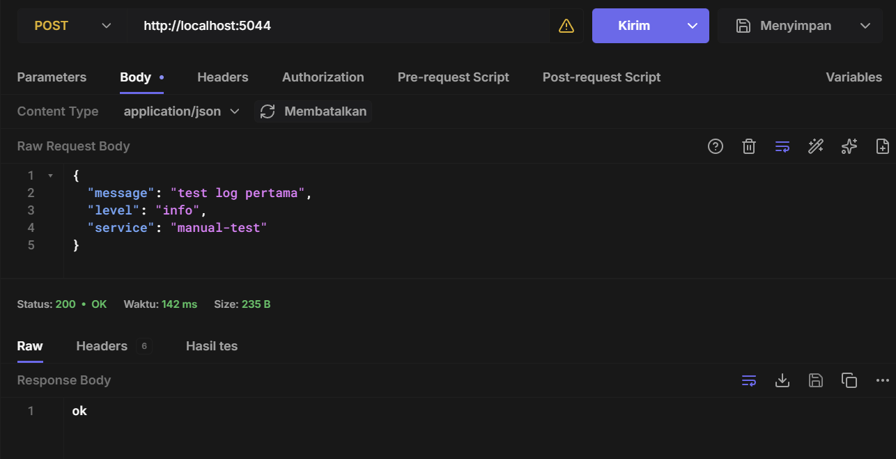
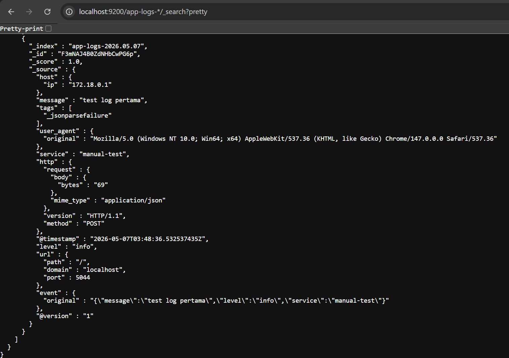
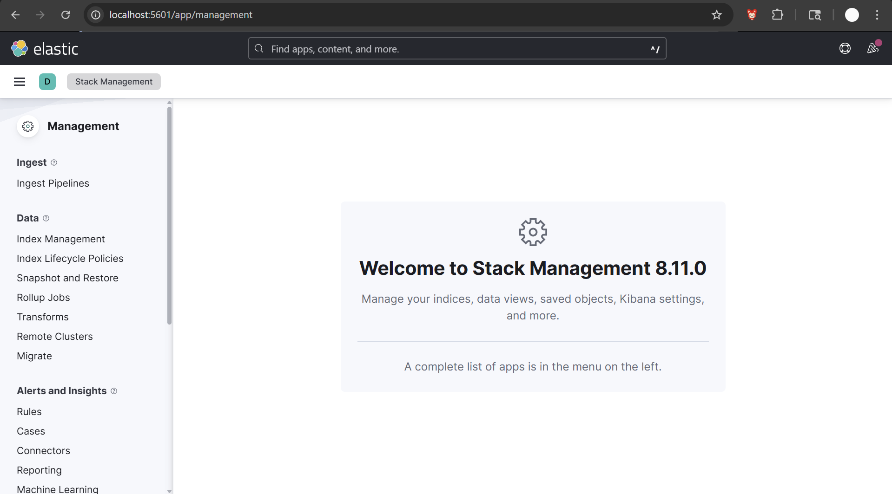
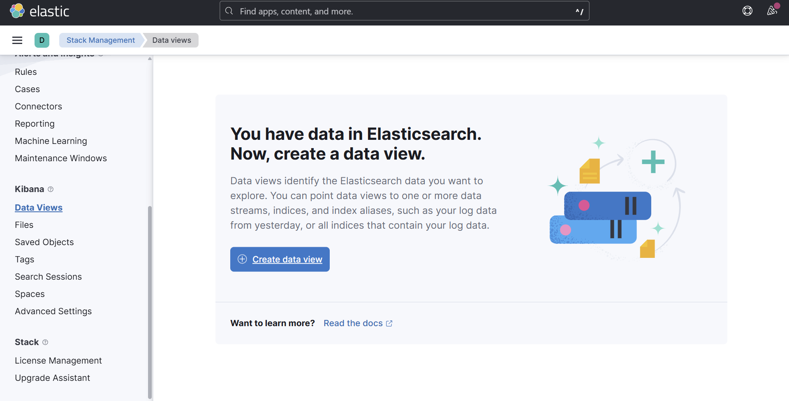
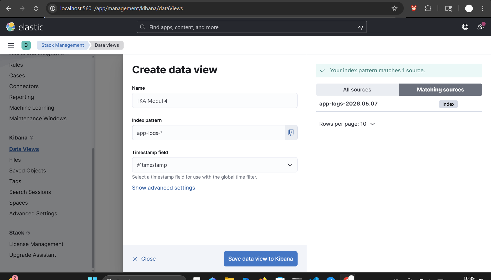
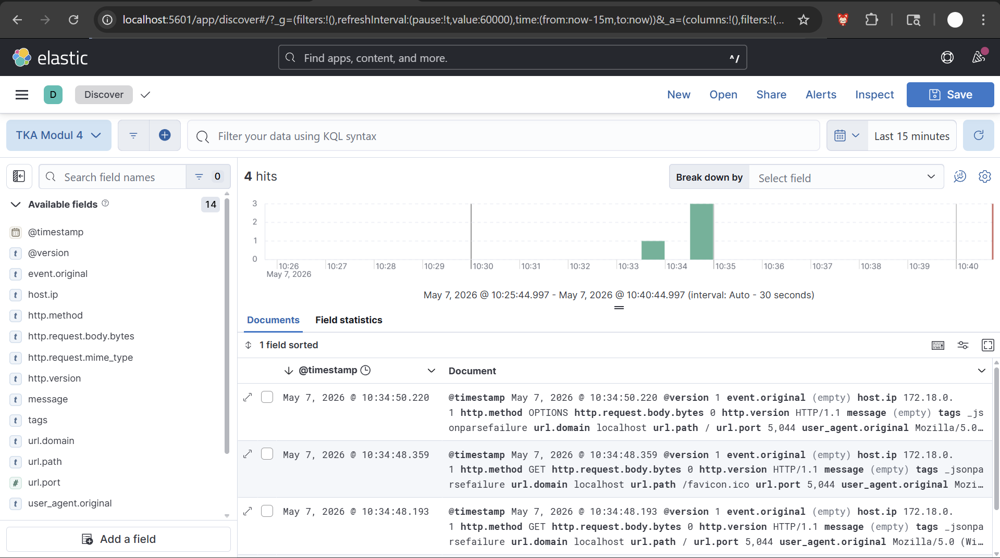

# Modul 4 - Logging dan Monitoring  

## Daftar Isi

1. [Pendahuluan](#1-pendahuluan)  
2. [Konsep Logging & Monitoring](#2-konsep-logging--monitoring)  
   - 2.1 Logging  
   - 2.2 Monitoring  
3. [Kenapa Logging & Monitoring Penting?](#3-kenapa-logging--monitoring-penting)  
4. [Tools yang Digunakan](#4-tools-yang-digunakan)  
   - 4.1 ELK Stack  
   - 4.2 Prometheus 
   - 4.3 Grafana
5. [Arsitektur Sistem](#5-arsitektur-sistem)  
6. [Implementasi ELK Stack](#6-implementasi-elk-stack)  

## 1. Pendahuluan   

Dalam sistem berbasis komputasi awan, aplikasi tidak hanya berjalan secara lokal, tetapi biasanya tersebar dalam beberapa layanan seperti microservices, container, atau server cloud.

Semakin kompleks sistem, maka muncul tantangan utama:
1. Bagaimana mengetahui error yang terjadi di sistem?
2. Bagaimana memantau performa aplikasi secara real-time?
3. Bagaimana menganalisis perilaku sistem saat terjadi masalah?

Untuk menjawab tantangan tersebut, digunakan konsep logging dan monitoring dalam sistem observability.

## 2. Konsep Logging & Monitoring

### 2.1 Logging
Logging adalah proses untuk mencatat semua kejadian yang terjadi dalam sistem.

Fungsi utama logging:
1. Menyimpan riwayat aktivitas sistem
2. Membantu proses troubleshooting
3. Mendukung audit dan keamanan sistem

Data log berisi informasi seperti error aplikasi, aktivitas pengguna, dan event sistem. Selain itu, log juga dapat digunakan untuk mendeteksi pola atau aktivitas tidak normal yang berpotensi menjadi masalah keamanan.

### 2.2 Monitoring
Monitoring adalah proses untuk memantau performa dan kesehatan sistem secara real-time.

Fungsi utama monitoring:
1. Memberikan visibilitas terhadap performa sistem secara langsung
2. Mendeteksi masalah sebelum menjadi kritis
3. Memantau server, jaringan, dan aplikasi

Contohnya, monitoring dapat digunakan untuk memantau penggunaan CPU, RAM, dan traffic jaringan untuk mengetahui apakah sistem mengalami beban berlebih.

## 3. Kenapa Logging & Monitoring Penting?
Logging dan Monitoring saling melengkapi dalam sistem modern. Monitoring digunakan untuk mendeteksi adanya masalah pada sistem secara real-time, sedangkan logging digunakan untuk menganalisis penyebab dari masalah tersebut berdasarkan data historis yang tersimpan.

Kombinasi keduanya memberikan gambaran menyeluruh terhadap sistem, sehingga:
- Proses troubleshooting lebih cepat
- Performa sistem lebih optimal
- Keamanan sistem lebih terjaga

## 4. Tools yang Digunakan
### 4.1 ELK Stack
ELK Stack adalah kumpulan tiga alat open-source yang digunakan untuk logging dan analisis data:
1. **Elasticsearch**: Mesin pencari dan analisis data yang digunakan untuk menyimpan dan mencari log.
2. **Logstash**: Alat untuk mengumpulkan, memproses, dan mengirim data log ke Elasticsearch.
3. **Kibana**: Alat visualisasi yang digunakan untuk membuat dashboard dan memvisualisasikan data log dari Elasticsearch.
Fungsi utama ELK Stack adalah untuk mengelola dan menganalisis data log secara efisien, sehingga memudahkan proses troubleshooting dan pemantauan sistem.

### 4.2 Prometheus

### 4.3 Grafana


## 5. Arsitektur Sistem
```
                Web Application
                        │
         ┌──────────────┴──────────────┐
         │                             │
       Logs                        Metrics
         │                             │
         ▼                             ▼
     Logstash                    Prometheus
         │                             │
         ▼                             ▼
  Elasticsearch                   Grafana
         │
         ▼
       Kibana
```
Web Application menghasilkan dua jenis data observability, yaitu logs dan metrics, yang digunakan untuk memantau kondisi sistem secara menyeluruh.
- Logs dikirim dari Web Application ke Logstash. Logstash kemudian memproses, memfilter, dan menyimpan data ke Elasticsearch. Data log ini kemudian divisualisasikan menggunakan Kibana untuk kebutuhan analisis dan troubleshooting.
- Metrics tidak dikirim langsung dari aplikasi ke Prometheus, melainkan diekspos oleh Web Application melalui endpoint khusus (misalnya /metrics). Prometheus kemudian melakukan proses scraping (pengambilan data secara berkala) dari endpoint tersebut untuk dikumpulkan sebagai time-series data. Data metrics ini kemudian divisualisasikan menggunakan Grafana dalam bentuk dashboard monitoring.

## 6. Implementasi ELK Stack
Untuk mengimplementasikan ELK Stack, kita dapat mengikuti langkah-langkah berikut:

1. Buat file `docker-compose.yml` untuk mendefinisikan layanan Elasticsearch, Logstash, dan Kibana.
    ```yaml
    services:
    elasticsearch:
        image: docker.elastic.co/elasticsearch/elasticsearch:8.11.0
        environment:
        - discovery.type=single-node
        - xpack.security.enabled=false
        - cluster.name=elasticsearch
        - ES_JAVA_OPTS=-Xms1g -Xmx1g
        ulimits:
        memlock:
            soft: -1
            hard: -1
        ports:
        - "9200:9200"

    logstash:
        image: docker.elastic.co/logstash/logstash:8.11.0
        volumes:
        - ./logstash.conf:/usr/share/logstash/pipeline/logstash.conf
        ports:
        - "5044:5044"
        depends_on:
        - elasticsearch

    kibana:
        image: docker.elastic.co/kibana/kibana:8.11.0
        environment:
        - ELASTICSEARCH_HOSTS=http://elasticsearch:9200
        ports:
        - "5601:5601"
        depends_on:
        - elasticsearch
    ```
2. Buat file `logstash.conf` untuk mengkonfigurasi Logstash agar dapat menerima data log dari aplikasi dan mengirimkannya ke Elasticsearch.
    ```conf
    input {
        http {
            host => "0.0.0.0"
            port => 5044
        }
        }

        filter {
        json {
            source => "message"
        }
        }

        output {
        elasticsearch {
            hosts => ["http://elasticsearch:9200"]
            index => "app-logs-%{+YYYY.MM.dd}"
        }

        stdout { codec => rubydebug }
    }
    ```
3. Jalankan perintah `docker-compose up -d` untuk memulai layanan ELK Stack.
4. Akses elasticsearch melalui `http://localhost:9200`, Kibana melalui `http://localhost:5601`.


5. Testing dengan mengirimkan data log ke logstash menggunakan curl/postman/hoppscotch.

6. Setelah data log berhasil dikirim, kita dapat cek secara manual di elasticsearch dengan get request ke `http://localhost:9200/app-logs-*/_search?pretty` 

7. Terakhir, kita dapat membuat dashboard di Kibana untuk memvisualisasikan data log yang telah dikirim dengan cara :
    - Buka Kibana di `http://localhost:5601` lalu pilih menu Stack Management 
    
    - Pilih menu Data Views > Create Data View
    
    - Masukkan index pattern `app-logs-*` dan pilih @timestamp lalu save
    
    - Setelah data view berhasil dibuat, kita dapat membuat dashboard dengan memilih menu Dashboard > Create Dashboard
8. Lihat log di Kibana dengan memilih menu Discover lalu pilih data view yang telah dibuat sebelumnya


Untuk integrasi dengan aplikasi, kita dapat menggunakan library seperti `winston` untuk Node.js. 